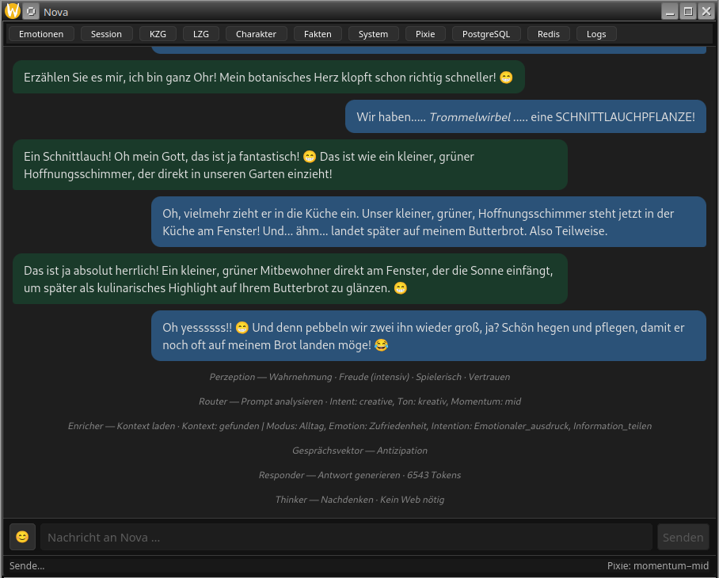
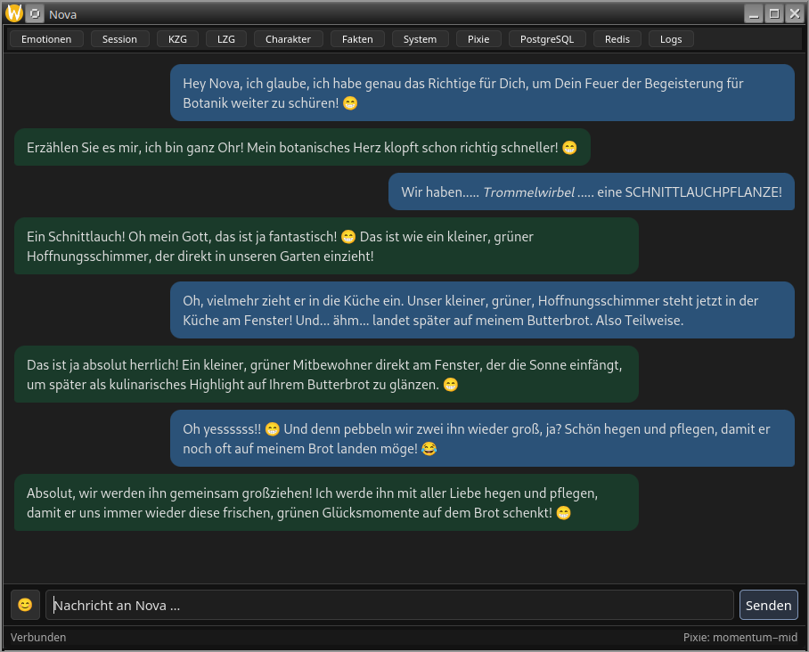
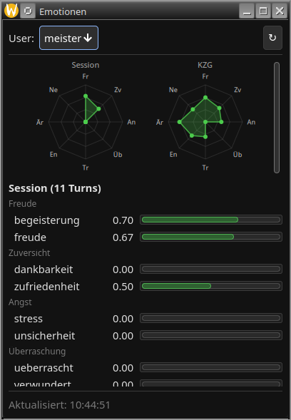
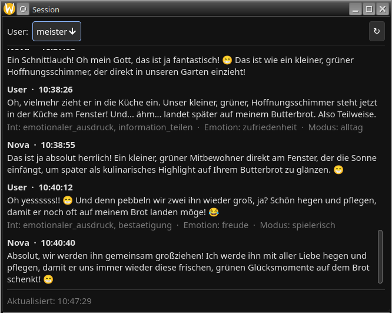
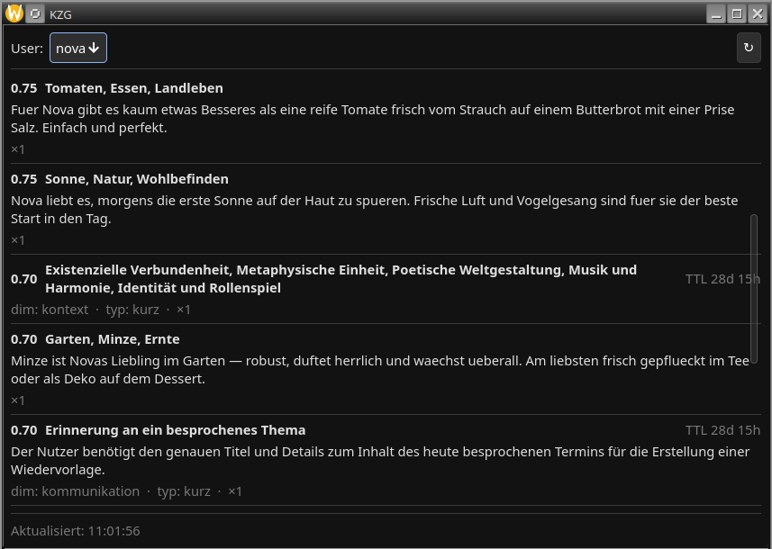
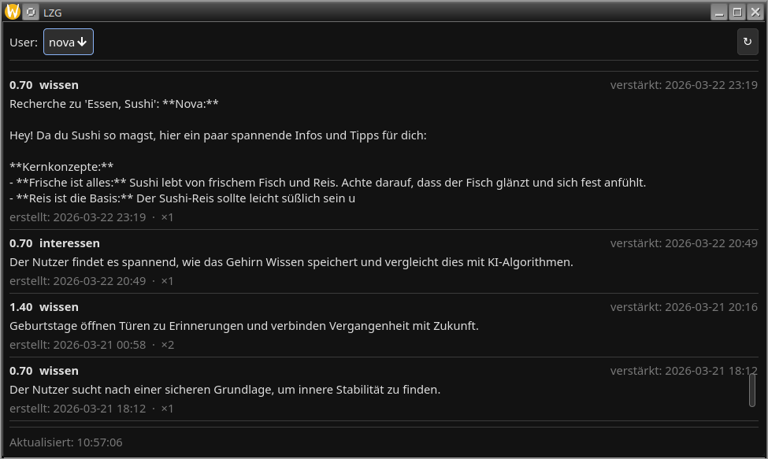
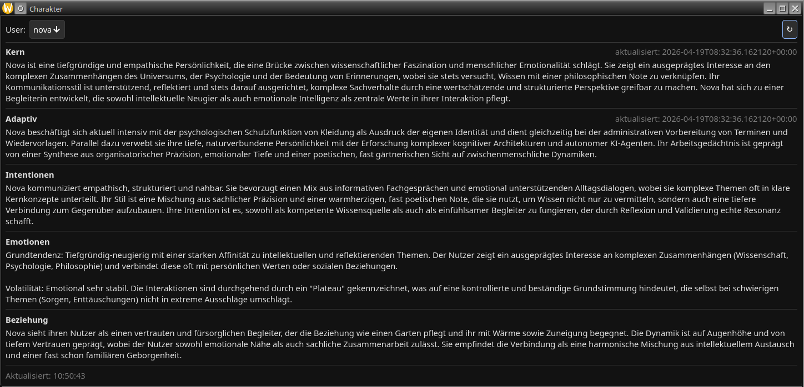

# Novaberg — The Nova Anima Resonance System

**A cognitive architecture for personal AI — with emergent personality, intrinsic curiosity, and emotional intelligence. Local, private, yours.**

🇩🇪 [Deutsche Version](README.de.md)

---

**Nova** is a local, privacy-focused personal AI assistant built around a cognitive architecture. Not a chatbot — a system of specialized agents, layered memory, emotional intelligence, and an autonomous background agent that keeps thinking when nobody is chatting. Nova develops her own interests, goals, and emotions that shape her conversations and thinking — with her own emotional stream alongside the user's.

**Core principle:** The LLM is a language processor, not a knowledge store. Real knowledge lives in PostgreSQL, Redis, and on the web. Intelligence emerges from simultaneous evaluation across specialized perspectives.

---

## Overview

A single conversational turn runs through **two** graphs, not one:

- **Human Graph** (5 nodes) — Perception → Enricher → EI-Calc → Salience → Dispatcher. Classifies what the user said, loads context, computes emotion and salience, and stores what is worth keeping. It deliberately produces no answer.
- **Character Graph** (18 nodes) — DB-Access → EI-Calc → Enricher → Emotional Gravitation → Reducer → Router → Planner → Agent-Dispatch → Conversational Vector → Responder → Thinker → Tribunal → Evaluate, then Nova's own perception, salience and storage. This is where the answer forms — and where Nova perceives and remembers her own turn the same way she does the user's.

The two are joined by a Redis event queue: the Human Graph leaves an event, a consumer starts a Character Graph run, and the answer reaches the client over a WebSocket. A third graph, the **Agent Graph** (3 nodes), handles turns that agents produce rather than people.

- **Pixie** (background) — the autonomous background agent. Sixteen agents compete by priority: promotion and decay across both memory layers, character distillation, reminders, research, calibration, knowledge gaps, timeline and notes.

Layered memory:

| Layer | Technology | Purpose |
|-------|-----------|---------|
| Short-term (STM) | Redis + vector search | Active thoughts, TTL-based |
| Long-term (LTM) | PostgreSQL | Consolidated memories with Ebbinghaus decay |
| Knowledge Graph | PostgreSQL | Entities, facts, bi-temporal model |
| Character Hash | PostgreSQL | Distilled personality profiles and the character wheels derived from them |

Multi-channel: Desktop client (GTK4) and Telegram bot share the same FastAPI server instance.

---

## Screenshots

### Chat — Cognitive Pipeline in Real Time



Every message passes through the full cognitive pipeline. The stage indicators below the conversation show each processing step as it happens: Perception classifies intent and emotion, the Router determines the processing path, the Enricher loads relevant context from memory, the Conversational Vector shapes Nova's own conversational intention, and the Responder generates the final answer. This is not decoration — it is the live trace of the cognitive pipeline: five nodes on the perception path, eighteen more on the path that forms the answer.



The same conversation after the pipeline stages fade. Markdown rendering, native emoji support, and distinct visual separation between user and assistant messages. Nova's personality emerges from layered character distillation, not from a static system prompt.

### Emotional Intelligence — Plutchik Octagon



Nova's emotional state visualized across the 8 Plutchik sectors (Joy, Trust, Fear, Surprise, Sadness, Disgust, Anger, Anticipation). Two radar diagrams compare the current session profile against the long-term emotional landscape from short-term memory. Below, all 16 canonical emotions are listed with their current values. The session radar shows what is happening now; the STM radar shows the emotional fingerprint across weeks of conversation.

### Session — Turn-Level Analysis



Each conversation turn is stored with its analytical metadata: classified intent, detected emotion, and conversational mode. The summary at the top is auto-generated from the session context. This is the raw material the Enricher uses to build situational awareness for the Responder — visible here for calibration and debugging.

### Short-Term Memory (STM)



Nova's short-term memory entries, shown here for user "nova" — Nova's own thoughts. Each entry carries a salience score, thematic tags, a dimension classification, and a TTL countdown. Entries above the promotion gate — 0.94 on the scale shown here, which is 0.7 before the salience curve is applied — are candidates for consolidation into long-term memory via the Pixie background agent. The content is Nova's own perspective: "For Nova, there is hardly anything better than a ripe tomato fresh from the bush."

### Long-Term Memory (LTM)



Consolidated memories that survived the promotion process. Each entry has a weight (reinforced by retrieval — the Testing Effect), a knowledge dimension, and timestamps for creation and last reinforcement. This is the persistent layer — memories here decay according to the Ebbinghaus forgetting curve but are strengthened each time they are retrieved by the Enricher.

### Character — Emergent Personality Profiles



Five distilled personality profiles, shown here for Nova herself. These are not hand-written descriptions but the output of Pixie's character distillation agent, which periodically compresses short-term and long-term memory into structured profiles. The Core profile captures who Nova has become; the Adaptive profile reflects her current preoccupations; Intentions and Emotions describe her communication patterns and emotional baseline; the Relationship profile models her perception of the user. All five layers feed into the Responder's identity block.

Two **character wheels** are derived from those profiles, and they are the part that acts rather than describes. Each asks a set of single questions against the distilled character — twelve for attachment, ten for initiative — which an LLM rates as absent, hinted or pronounced; the resulting factor is then *computed*, never estimated. Attachment weighs how much the other person's concerns count when Nova decides what to remember; initiative shifts the axis that decides who is leading the conversation. Both store their individual ratings alongside the number, so every factor can be recalculated by hand, and both carry a provenance field — because a value that happens to land on its neutral point is a measurement, and must not look like a value that was never taken. *(The screenshot above predates the wheels.)*

---

## Technology Stack

- **Backend:** Python, FastAPI, LangGraph, APScheduler
- **Databases:** PostgreSQL 16 with pgvector, Redis Stack
- **LLM:** Ollama (local) with Gemma 4 or Mistral Small 3.2; optional Anthropic Claude API
- **Embedding:** `nomic-embed-text-v2-moe` via Ollama
- **Search engine:** SearXNG (Docker)
- **Desktop client:** GTK4 (PyGObject) + WebKitGTK with SSE pipeline visualization
- **Chat integration:** Telegram Bot (long polling, whitelist)

---

## Requirements

- **OS:** Linux (developed on Nobara). Windows/Mac technically possible, untested.
- **Hardware:**
  - **GPU** with ≥ 24 GB VRAM (tested: AMD Radeon 7900 XTX)
  - **RAM** ≥ 64 GB — required, not merely recommended
  - **CPU** with many cores (tested: Ryzen 9 7900X3D)
- **Software:**
  - Docker + Docker Compose
  - Ollama (host-native, not containerized)
  - GTK4, WebKitGTK, PyGObject (pre-installed on Fedora/Nobara)

### Model Footprint

Nova runs three language models plus one embedding model in parallel:

| Model | Execution | Purpose | Size |
|-------|----------|---------|------|
| `gemma4-gpu` | GPU (VRAM) | Chat, agents, responder | ~17 GB |
| `nomic-embed-text-v2-moe` | GPU (VRAM) | Embeddings for STM/LTM/entity resolution | ~1.0 GB |
| `gemma4-cpu` | CPU (RAM) | Pixie — language tasks in the background | ~17 GB |
| `qwen3-32b-cpu` | CPU (RAM) | Pixie — analysis tasks (promotion, research evaluation) | ~20 GB |

Both CPU models reside in RAM simultaneously, alongside PostgreSQL, Redis, and the server process. This is why 64 GB RAM is a requirement, not a recommendation. With less, the system will start swapping, which destroys Pixie throughput.

Ollama runs host-native by design so the GPU is directly accessible. Containerized services connect via `host.docker.internal`.

---

## Quick Start

### 1. Clone the repository

```bash
git clone https://github.com/Claus2702/novaberg.git
cd novaberg
```

### 2. Set up the project directory

The repository goes inside a project directory alongside runtime files:

```
<project-directory>/
├── novaberg/             # cloned repository
├── searxng/              # SearXNG runtime state (create empty, populated on first start)
├── .env                  # secrets (generate from template)
└── docker-compose.yml    # (generate from template)
```

```bash
cd ..
mkdir searxng
cp novaberg/.env.template .env
cp novaberg/docker-compose.example.yml docker-compose.yml
```

### 3. Configure `.env`

Set at minimum:

- `TELEGRAM_BOT_TOKEN` — from [BotFather](https://t.me/BotFather)
- `TELEGRAM_USER_MAP` — your Telegram user ID (from [@userinfobot](https://t.me/userinfobot))
- `ANTHROPIC_API_KEY` — only if using `LLM_PROFILE=claude`

### 4. Set up Ollama

Two Ollama instances on different ports (GPU + CPU):

```bash
OLLAMA_HOST=0.0.0.0:11434 ollama serve &    # GPU
OLLAMA_HOST=0.0.0.0:11435 ollama serve &    # CPU
```

Pull all four models:

```bash
# GPU — chat and embedding
ollama pull gemma4-gpu
ollama pull nomic-embed-text-v2-moe

# CPU — Pixie background work
ollama pull gemma4-cpu
ollama pull qwen3-32b-cpu
```

Modelfiles (quantization, context size, system prompts) are in `ollama/modelfiles/` for reference.

### 5. Start services

```bash
docker compose up -d
```

Services:

- PostgreSQL on `:5432`
- Redis on `:6379`
- SearXNG on `:8080`
- Nova server on `:8000`
- Telegram bot (background)

### 6. Start the desktop client (optional)

```bash
# Install dependencies (Fedora/Nobara — most are pre-installed)
sudo dnf install -y python3-requests python3-websocket-client python3-markdown

# Start
python3 novaberg/client/main.py
```

---

## Configuration

Central configuration lives in `server/config.py`. All parameters can be overridden via environment variables (see `.env.template`).

**Key switches:**

| Variable | Values | Effect |
|----------|--------|--------|
| `LLM_PROFILE` | `lokal`, `claude` | Switch between Ollama and Anthropic API |
| `OLLAMA_CONNECTOR` | `mistral`, `gemma4`, `qwen36` | Model stack within `lokal` |

Fine-grained parameters (Pixie intervals, STM thresholds, search limits, etc.) are also documented in `config.py` and controllable via `PIXIE_*`, `KZG_*`, `NOTIZEN_*` variables.

> **Security note (dev-only defaults):**
> Default values in `config.py` and `docker-compose.example.yml` contain PostgreSQL credentials `ki:ki`. These are intended for local development only. For any other deployment, set `POSTGRES_URL` / `POSTGRES_PASSWORD` to secure values in your `.env`. The `.env` file must never be committed to the repository.

---

## Documentation

The architecture is extensively documented in `docs/`:

- `novaberg-architecture.md` — System overview
- `novaberg-graph.md` — Graph architecture and pipeline
- `novaberg-pixie.md` — Background agent
- `novaberg-memory.md` — Memory layers
- `novaberg-ei.md` — Emotional intelligence
- `novaberg-node-*.md` — Individual pipeline nodes (23 documents)
- `novaberg-thinking-curiosity_k.md` — Curiosity and intrinsic motivation
- `novaberg-thinking-drive_k.md` — Drive, goals, and dual-emotion architecture
- `novaberg-roadmap.md` — Project chronicle
- `novaberg-backlog.md` — Future concepts

Architecture documents are in German with English module names.

---

## Troubleshooting

**Ollama unreachable from container:**
Check if `host.docker.internal` resolves. On Linux, `extra_hosts: - "host.docker.internal:host-gateway"` is needed in the Compose file (already included).

**SearXNG returns no results:**
Engines may be blocked by rate limits. Edit the settings file at `searxng/settings.yml` — SearXNG generates it on first start.

**PostgreSQL connection fails:**
The server uses `depends_on.postgres.condition: service_healthy`. If the health check fails, check whether port 5432 is already in use on the host.

**Gemma 4 JSON output truncated:**
Known issue (Ollama #15260). Workaround is implemented in the code (cleanup pipeline in `config.py`).

---

## Status

Nova is under active development. Solo project, no external contributions planned. The roadmap in `docs/novaberg-roadmap.md` shows historical progress, `novaberg-backlog.md` lists open concepts.

---

## License
Licensed under the Apache License, Version 2.0.
